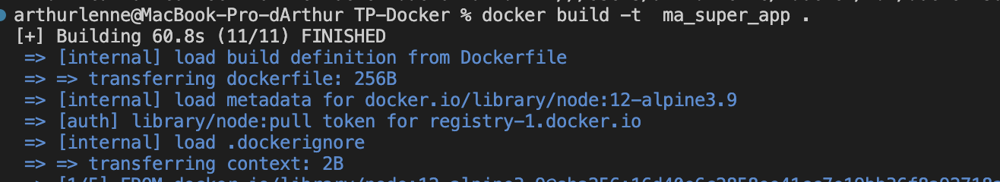
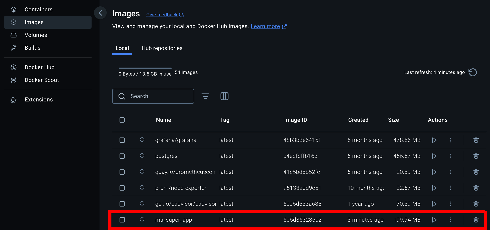
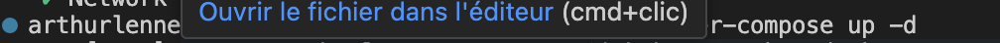
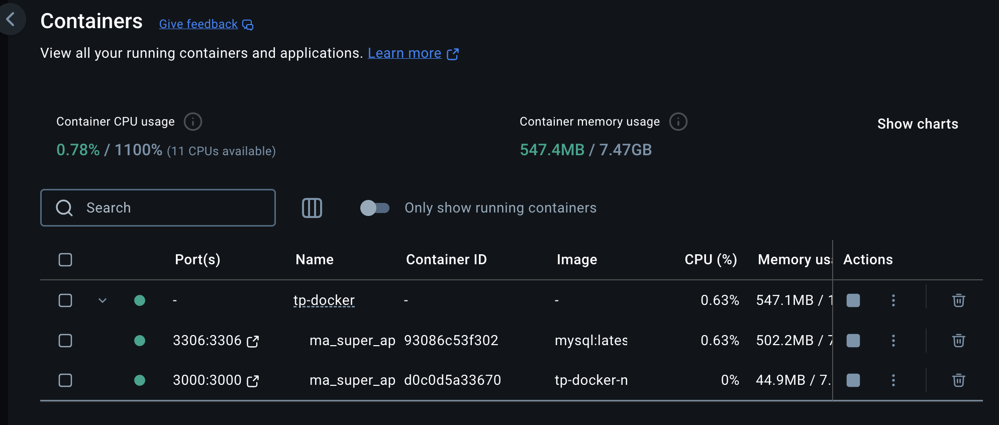

# TP-Docker

## Question 2:

L'option npm est `npm install`. Elle permettra d'installer toutes les dépendances nécessaires dans le container. Cela permettra d'avoir une image Docker reproductible et stable.

## Question 3:

La commande pour build l'image Docker est la suivante : `docker build -t ma_super_app .`  

## Question 4:

