# TP-Docker

## TP-1

### Question 3:
a) Récupération de l'image nginx depuis Docker Hub:<br>
`docker pull nginx`

b) Vérification de la présence de l'image nginx:<br>
`docker images`
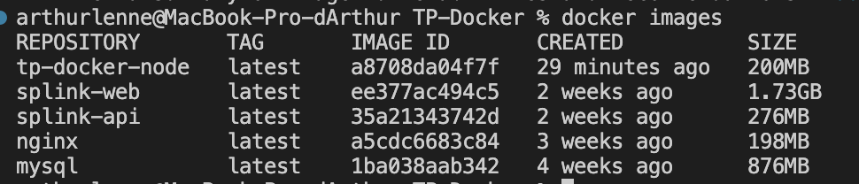

c) (Cf. index.html)

d) Lancement du container:<br>
`docker run --name TP-1 -d -p 8080:80 -v $(pwd)/TP-1:/usr/share/nginx/html nginx`
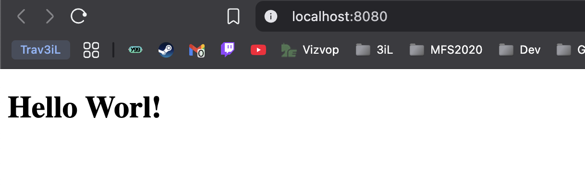

e) 
#### Suppression:<br>
`docker stop tp-nginx-vol
docker rm tp-nginx-vol`

#### Utilisation de la commande `cp`

- Démarrage du container sans volume:<br>
`docker run --name tp-nginx-cp -d -p 8080:80 nginx`

- Copie des fichiers:<br>
`docker cp ./TP-1/index.html TP-1:/usr/share/nginx/html/index.html`


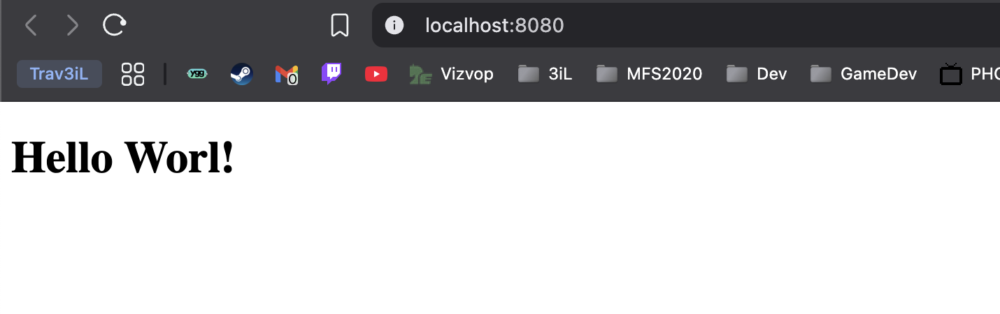

### Question 4:
a) Création du Dockerfile (cf. Dockerfile)

b) 
#### Build de cette nouvelle image:
```bash
cd TP-1/

docker build -t tp-1 .
```
<br>

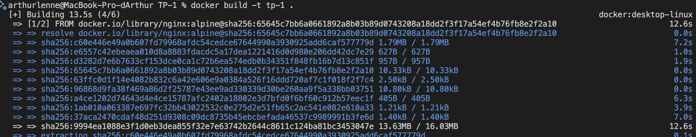

#### Exécution de cette nouvelle image fraîchement build:

`docker run --name tp-1 -d -p 8080:80 tp-1`
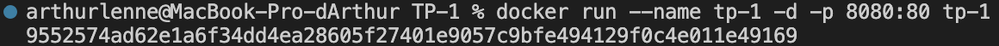
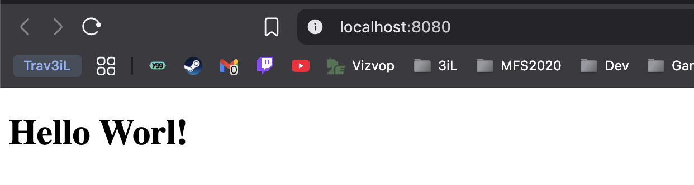

c)
- Différences:
    - La procédure 3 utilise une image officielle de `nginx`. Tandis que la procédure 6 utilise une image personnalisé.

    - La procédure 3 utilise un volume externe via `-v` contrairement à la 4.

    - La procédure 3 ne nécessite que d'une seule commande pour être lancée `docker run` là où la procédure 4 en appelle 2: `docker build` et `docker run`

- Conclusion:<br>
Les deux procédures ont leurs avantages et inconvénients mais pour faire simple:

    - Procédure 3 : rapide et idéale pour le dev car on peut modifier les fichiers sans rebuild grâce au volume.

    - Procédure 4: plus adaptée pour le déploiement en prod car on va venir versionner, contrôler et verifier que notre image contient bien tous les fichiers nécessaires sans dépendance au disque local.

### Question 5:

a) Récupération des images mysql:5.7 et phpmyadmin:latest

`docker pull mysql:5.7` et `docker pull phpmyadmin:latest`

b) Lancement du container mysql et phpmyadmin:

- MySQL:<br>
```bash
docker run --name mysql57 -e MYSQL_ROOT_PASSWORD=root -e MYSQL_DATABASE=tp_db -p 3306:3306 -d mysql:5.7
```

- PHPMyAdmin:<br>
```bash
docker run --name myphpadmin -d \
  --link mysql57:db \
  -p 8080:80 \
  -e PMA_HOST=db \
  -e PMA_PORT=3306 \
  phpmyadmin/phpmyadmin
```

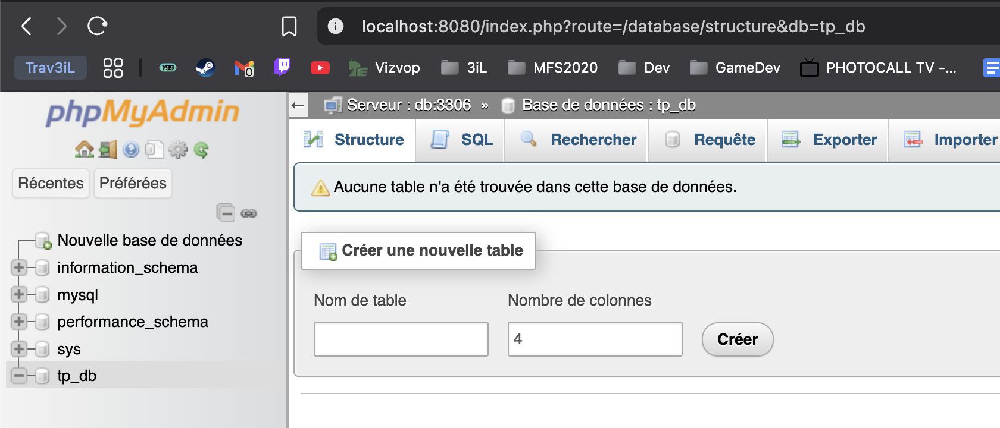
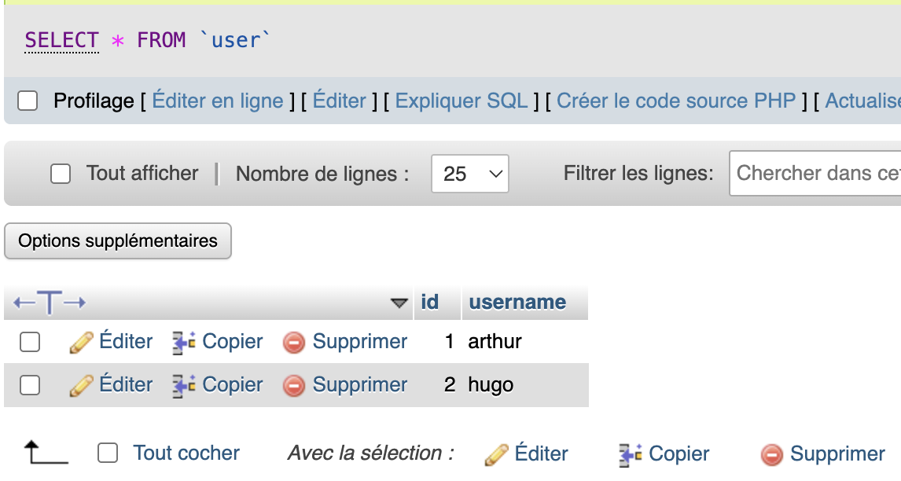
## TP-2

### Question 2:

L'option npm est `npm install`. Elle permettra d'installer toutes les dépendances nécessaires dans le container. Cela permettra d'avoir une image Docker reproductible et stable.

### Question 3:

La commande pour build l'image Docker est la suivante : `docker build -t ma_super_app .`<br><br>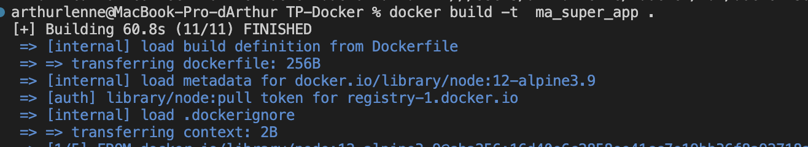

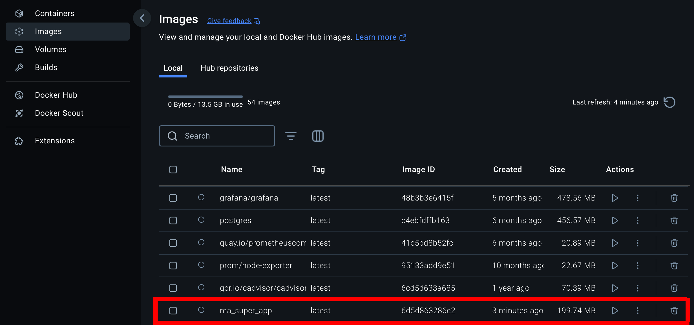

### Question 4:


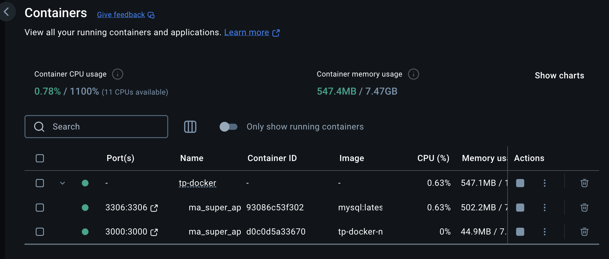


## TP-3
2) Initialisation du projet React vierge (voir dossier TP-3)

```bash
npx create-next-app@latest
cd my-app
npm run build
npm start
```
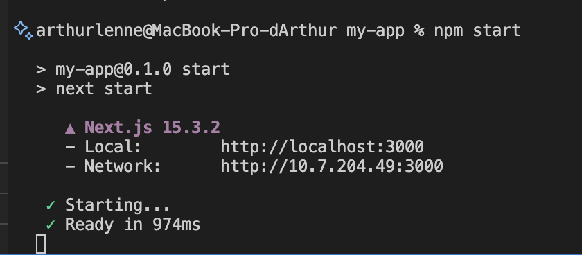
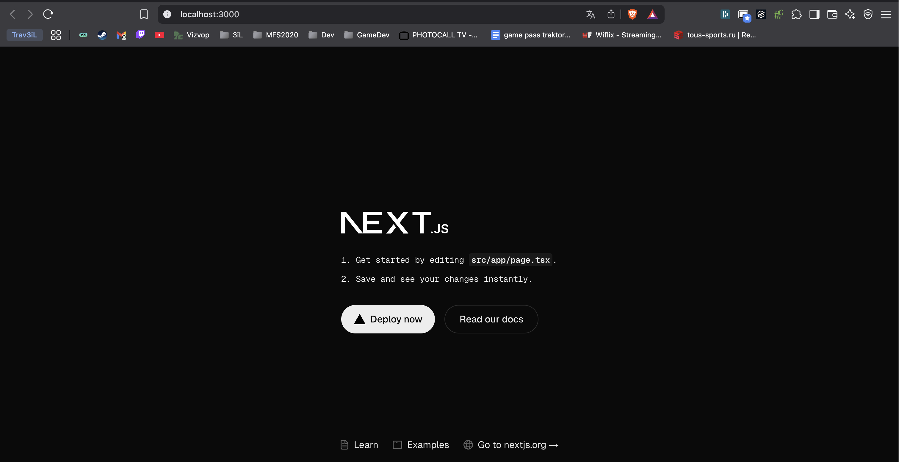