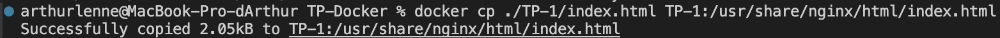

# TP-Docker

## TP-1

### Question 5:
a) Récupération de l'image nginx depuis Docker Hub: 
`docker pull nginx`

b) Vérification de la présence de l'image nginx: 
`docker images`

c) (Cf. index.html)

d) Lancement du container: 
`docker run --name TP-1 -d -p 8080:80 -v $(pwd)/TP-1:/usr/share/nginx/html nginx`

e) 
#### Suppression: 
`docker stop tp-nginx-vol
docker rm tp-nginx-vol`

#### Utilisation de la commande `cp`

- Démarrage du container sans volume: 
`docker run --name tp-nginx-cp -d -p 8080:80 nginx`

- Copie des fichiers: 
`docker cp ./TP-1/index.html TP-1:/usr/share/nginx/html/index.html`

### Question 6:

## TP-2

### Question 2:

L'option npm est `npm install`. Elle permettra d'installer toutes les dépendances nécessaires dans le container. Cela permettra d'avoir une image Docker reproductible et stable.

### Question 3:

La commande pour build l'image Docker est la suivante : `docker build -t ma_super_app .`  

### Question 4:

